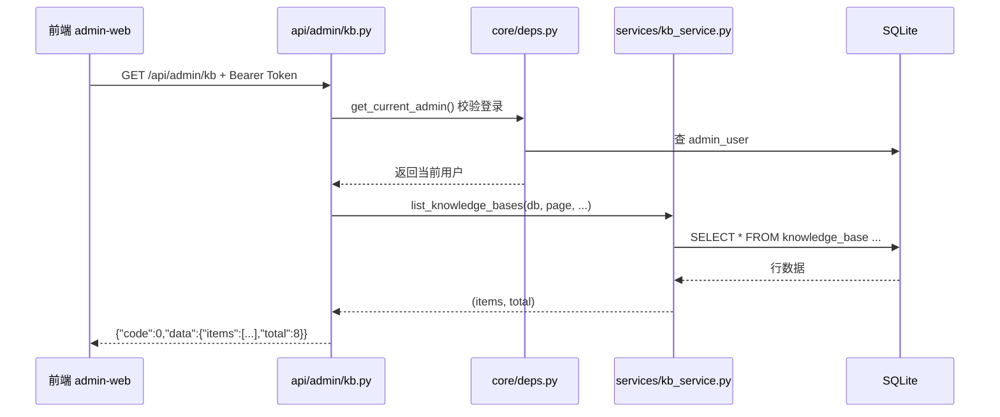

# 用智问后端学 Python

> 面向有前端经验、想借真实项目入门 Python 后端的读者。  
> 示例代码均来自本仓库 `backend/app/`，可直接对照阅读。

---

## 1. 为什么要学这套结构？

智问后端不是「把所有逻辑写在一个 `main.py`」的脚本式写法，而是典型的 **Web API 分层架构**：

```text
请求 → API 路由层 → Service 业务层 → Model 数据层 → SQLite/MySQL
         ↑              ↑
      Schemas 校验    Core 基础设施（配置、鉴权、异常）
```

这样设计的好处：

| 优势 | 说明 |
|------|------|
| **职责清晰** | 路由只负责「接请求、返响应」；业务逻辑在 `services/`；表结构在 `models/` |
| **易于测试** | 可以单独测 `kb_service.list_knowledge_bases()`，不必启动整个 HTTP 服务 |
| **前后端协作** | `schemas/` 定义的数据形状与前端 TypeScript 接口一一对应 |
| **可替换** | 换数据库、换 LLM 提供商，往往只改 `core/` 或某个 `service`，不动 API 路由 |
| **可演进** | 用 Alembic 管理表结构变更，不用手工改库 |

如果你熟悉 Vue3 项目里的 `views / api / stores / types` 分工，可以类比为：

| 前端（admin-web） | 后端（backend） |
|------------------|----------------|
| `views/*.vue` 页面 | `api/**/*.py` 路由 |
| `api/*.ts` 请求封装 | `services/*.py` 业务逻辑 |
| `types/index.ts` 类型 | `schemas/*.py` 数据模型 |
| 浏览器本地状态 | `models/*.py` + 数据库 |

---

## 2. 项目目录一张图

```text
backend/
├── app/                     # ★ 业务代码（你主要读写这里）
│   ├── main.py              # 程序入口：创建 FastAPI、挂中间件、注册路由
│   ├── core/                # 基础设施（配置、JWT、依赖注入、异常）
│   ├── db/                  # 数据库连接、Base 类、初始化 seed
│   ├── models/              # ORM 模型 = 数据库表的长什么样
│   ├── schemas/             # Pydantic 模型 = API 入参/出参长什么样
│   ├── api/                 # HTTP 路由（admin 管理端 / public C 端）
│   └── services/            # 业务逻辑（真正干活的地方）
├── alembic/                 # 数据库迁移脚本
├── data/                    # SQLite 数据库文件（运行时生成，不进 Git）
├── uploads/                 # 用户上传文档的本地存储（不进 Git）
├── seed/                    # Demo 样例文档
├── scripts/                 # 一次性运维脚本（如灌 mock 数据）
├── tests/                   # 单元/集成测试（预留，目前为空）
├── .venv/                   # Python 虚拟环境（不进 Git）
├── requirements.txt         # Python 依赖清单
├── alembic.ini              # Alembic 迁移工具配置
├── .env / .env.example      # 环境变量（密钥只在 .env，不进 Git）
├── .python-version          # 指定 Python 3.11（给 uv/pyenv 用）
├── README.md                # 后端总览与启动说明
├── database.md              # 数据表设计文档
├── modules.md               # 模块职责、RAG 流水线
├── api-admin.md             # 管理端 API 文档
└── api-public.md            # C 端公开 API 文档
```

### 2.1 `app/` 内部（业务代码）

这是后端的核心，日常开发 90% 的时间都在这里：

| 子目录 | 作用 |
|--------|------|
| `main.py` | 应用入口，挂载路由和中间件 |
| `core/` | 配置、JWT、鉴权依赖、统一异常、加密、限流 |
| `db/` | 数据库 Session、`Base` 基类、首次启动 seed 管理员 |
| `models/` | SQLAlchemy 表模型（一行 Python 类对应一张表） |
| `schemas/` | Pydantic 请求/响应模型（类似前端 TypeScript 类型） |
| `api/` | HTTP 路由：`admin/` 管理端、`public/` C 端 |
| `services/` | 业务逻辑：CRUD、RAG、解析、向量化、LLM 调用等 |

**建议阅读顺序：**

1. `app/main.py` — 程序怎么启动  
2. `app/api/admin/kb.py` — 一个完整 CRUD 接口长什么样  
3. `app/services/kb_service.py` — 业务怎么写  
4. `app/models/knowledge_base.py` — 表怎么定义  
5. `app/schemas/kb.py` — 请求/响应怎么校验  

### 2.2 `app/` 以外的文件夹

这些目录**不是业务逻辑**，而是围绕「怎么跑起来、数据存哪、表怎么升级」的支撑设施：

| 目录 | 作用 | 日常要不要动 |
|------|------|--------------|
| **`alembic/`** | 数据库**版本迁移**。`versions/` 里每个 `.py` 是一次表结构变更（建表、加字段等）；`env.py` 负责连接数据库并执行迁移 | 改表结构时会用 |
| **`data/`** | 存放 **SQLite 数据库文件**（如 `app.db`）。应用启动、迁移后自动生成 | 运行时数据，一般只备份不手改 |
| **`uploads/`** | 用户上传文档的**本地文件存储**，按知识库 id 分子目录（如 `uploads/3/xxx.md`） | 上传后自动生成 |
| **`seed/`** | **样例文档**（如 `02-常见问题.md`），用于 Demo 或初始化导入 | 可放演示素材 |
| **`scripts/`** | **一次性运维脚本**，如 `seed_demo_data.py` 给仪表盘灌 mock 数据 | 需要时手动执行 |
| **`tests/`** | **单元/集成测试**目录（目前基本为空，预留） | 以后写测试用 |
| **`.venv/`** | Python **虚拟环境**，`pip install` 的依赖都装在这里 | 本地自动生成，勿提交 Git |

**三者关系（容易混）：**

```text
app/models/*.py     →  Python 里「表长什么样」（日常读写用）
alembic/versions/   →  「表结构从版本 A 升到 B」的变更脚本
data/app.db         →  真正存数据的地方
uploads/            →  上传的原始 pdf/md 文件（解析前的磁盘副本）
```

改字段时的正确顺序：先改 `models/` → 生成 Alembic 迁移 → `alembic upgrade head` → 数据写入 `data/app.db`。

### 2.3 根目录配置与文档

| 文件 | 作用 |
|------|------|
| **`requirements.txt`** | Python 依赖清单（FastAPI、SQLAlchemy、Alembic 等） |
| **`alembic.ini`** | Alembic 配置：迁移脚本位置、默认数据库 URL |
| **`.env`** | 本机私密配置：数据库地址、JWT 密钥、CORS 等（**不进 Git**） |
| **`.env.example`** | 环境变量模板，新同事复制为 `.env` 后填写 |
| **`.python-version`** | 锁定 Python 3.11，配合 uv 创建虚拟环境 |
| **`.gitignore`** | 忽略 `.venv/`、`data/`、`uploads/`、`.env` 等不该提交的内容 |
| **`README.md`** | 后端总览、本地启动命令 |
| **`database.md`** | 各张表的字段、索引、ER 关系说明 |
| **`modules.md`** | 代码目录规划、RAG 流水线、各 service 职责 |
| **`api-admin.md`** | 管理端 `/api/admin/*` 接口说明 |
| **`api-public.md`** | C 端 `/api/public/*` 接口说明 |

### 2.4 你平时会碰哪些？

| 场景 | 主要涉及的目录/文件 |
|------|---------------------|
| 写接口、改业务 | `app/api/`、`app/services/`、`app/schemas/` |
| 改表结构 | `app/models/` + `alembic/versions/` |
| 改配置（端口、密钥） | `.env` |
| 本地启动 | `app/main.py`、`.venv/`、`requirements.txt` |
| 灌 Demo 数据 | `scripts/seed_demo_data.py` |
| 查接口契约 | `api-admin.md`、`api-public.md` 或 Swagger `/docs` |
| 部署运维 | `data/`、`uploads/`、`.env`（生产路径见 [`docs/config.md`](./config.md)） |

生产服务器上目录结构与本地一致，典型路径为 `/srv/ai-kb-demo/backend/`，数据库在 `/srv/ai-kb-demo/backend/data/app.db`。

---

## 3. 一次请求是怎么走完的？

以「管理端获取知识库列表」为例：`GET /api/admin/kb?page=1`



对应代码链路：

```python
# ① 路由层：app/api/admin/kb.py
@router.get("", response_model=ApiResponse[PaginatedData[KnowledgeBaseResponse]])
def get_kb_list(
    page: int = Query(1, ge=1),           # 查询参数，最小为 1
    db: Session = Depends(get_db),        # 自动注入数据库会话
    _admin: AdminUser = Depends(get_current_admin),  # 自动校验 JWT
):
    items, total = list_knowledge_bases(db, page=page, ...)
    return ApiResponse(data=PaginatedData(...))

# ② 业务层：app/services/kb_service.py
def list_knowledge_bases(db: Session, *, page: int, page_size: int, ...):
    query = select(KnowledgeBase)
    items = db.scalars(query.offset(...).limit(...)).all()
    return list(items), total
```

**设计优势：** 路由函数通常只有 5～10 行，读起来像「菜单」；复杂 SQL 和规则都在 service，不会把 HTTP 层撑爆。

---

## 4. Python 基础语法（结合项目代码）

### 4.1 变量、类型注解

Python 3.11 推荐写类型，IDE 和 FastAPI 都能受益：

```python
# app/services/kb_service.py
def get_kb_or_404(db: Session, kb_id: int) -> KnowledgeBase:
    #            ↑ 参数类型      ↑ 返回值类型
    kb = db.get(KnowledgeBase, kb_id)
    if not kb:
        raise AppException(40401, "知识库不存在", 404)
    return kb
```

常见写法对照：

| 写法 | 含义 | 项目示例 |
|------|------|----------|
| `str` | 字符串 | `username: str` |
| `int` | 整数 | `kb_id: int` |
| `bool` | 布尔 | `is_public: bool` |
| `str \| None` | 可选字符串 | `description: str \| None` |
| `list[T]` | 列表 | `items: list[KnowledgeBase]` |
| `tuple[A, B]` | 固定长度元组 | `tuple[list[KnowledgeBase], int]` |

### 4.2 函数：位置参数与关键字参数

```python
# * 后面的参数必须用「键=值」方式传
def list_knowledge_bases(
    db: Session,
    *,
    page: int,
    page_size: int,
    keyword: str | None = None,
):
    ...

# 调用
list_knowledge_bases(db, page=1, page_size=20, keyword="产品")
```

`**` 的好处：调用时不会把 `page` 和 `page_size` 顺序传反。

### 4.3 类（class）

```python
# app/models/knowledge_base.py
class KnowledgeBase(Base, TimestampMixin):
    __tablename__ = "knowledge_base"   # 对应数据库表名

    id: Mapped[int] = mapped_column(primary_key=True, autoincrement=True)
    name: Mapped[str] = mapped_column(String(128), nullable=False)
    is_public: Mapped[bool] = mapped_column(Boolean, default=True)
```

- `class` 定义「一类东西」的属性和行为  
- 继承 `Base` 表示这是一张数据库表  
- 继承 `TimestampMixin` 复用 `created_at` / `updated_at` 字段  

### 4.4 装饰器（@）

```python
# app/main.py
@asynccontextmanager
async def lifespan(app: FastAPI):
    init_db()   # 应用启动时执行
    yield

@router.get("")   # 把函数注册成 GET 路由
def get_kb_list(...):
    ...
```

装饰器 = 在不改函数内部代码的前提下，给它「额外套一层能力」。  
`@router.get` 等价于前端路由表里配置一个 path。

### 4.5 生成器与 `yield`（依赖注入）

```python
# app/core/deps.py
def get_db() -> Generator[Session, None, None]:
    yield from _get_db()
```

`yield` 在这里表示：请求开始时打开数据库连接，请求结束后自动关闭。  
FastAPI 的 `Depends(get_db)` 会自动管理这个生命周期。

### 4.6 异常

```python
# 项目不用到处 try/except，而是抛统一业务异常
raise AppException(40401, "知识库不存在", 404)
```

`core/exception_handlers.py` 会把它转成前端熟悉的 JSON：

```json
{ "code": 40401, "message": "知识库不存在", "data": null }
```

### 4.7 模块导入

```python
from app.models.knowledge_base import KnowledgeBase
from app.services.kb_service import list_knowledge_bases
```

- `from A import B`：从模块 A 拿 B  
- 点号 `.` 表示包路径，类似 `import { x } from '@/api/kb'`  

---

## 5. 数据库与建表

### 5.1 三层概念，不要混

| 概念 | 文件位置 | 作用 |
|------|----------|------|
| **ORM Model** | `app/models/*.py` | Python 类 ↔ 表结构，日常读写用 |
| **Alembic 迁移** | `alembic/versions/*.py` | 版本化 DDL，团队同步表变更 |
| **物理库文件** | `data/app.db` | SQLite 真正存数据的地方 |

**优势：** 改表走迁移脚本，可回滚、可审计，而不是直接手工改数据库。

### 5.2 Model 示例：知识库表

```python
# app/models/knowledge_base.py（节选）
class KnowledgeBase(Base, TimestampMixin):
    __tablename__ = "knowledge_base"
    __table_args__ = (
        Index("idx_kb_status", "status"),
        Index("idx_kb_public", "is_public", "status"),
    )

    id: Mapped[int] = mapped_column(primary_key=True, autoincrement=True)
    name: Mapped[str] = mapped_column(String(128), nullable=False)
    description: Mapped[str | None] = mapped_column(Text, nullable=True)
    status: Mapped[str] = mapped_column(String(16), nullable=False, default="active")
    is_public: Mapped[bool] = mapped_column(Boolean, default=True, nullable=False)
    doc_count: Mapped[int] = mapped_column(Integer, default=0, nullable=False)
    chunk_count: Mapped[int] = mapped_column(Integer, default=0, nullable=False)

    documents = relationship("Document", back_populates="knowledge_base", ...)
```

字段对照：

| Python 类型 | 数据库 | 说明 |
|-------------|--------|------|
| `Mapped[int]` | INTEGER | 主键、计数 |
| `Mapped[str]` | VARCHAR/TEXT | 短文本/长文本 |
| `Mapped[bool]` | BOOLEAN | 是否公开 |
| `relationship(...)` | 外键关联 | ORM 层面的「一对多」 |

### 5.3 公共 Mixin：时间戳

```python
# app/db/base.py
class TimestampMixin:
    created_at: Mapped[datetime] = mapped_column(DateTime, default=func.now(), nullable=False)
    updated_at: Mapped[datetime] = mapped_column(DateTime, default=func.now(), onupdate=func.now(), ...)
```

**优势：** 每张表都要创建/更新时间，抽成 Mixin 避免复制粘贴。

### 5.4 Alembic 迁移在做什么？

迁移脚本 = 「从版本 A 到版本 B，数据库要执行哪些 SQL」。

```python
# alembic/versions/64ebcd270c0f_initial_schema.py（节选）
def upgrade() -> None:
    op.create_table('knowledge_base',
        sa.Column('id', sa.Integer(), autoincrement=True, nullable=False),
        sa.Column('name', sa.String(length=128), nullable=False),
        ...
        sa.PrimaryKeyConstraint('id')
    )
    op.create_index('idx_kb_status', 'knowledge_base', ['status'])
```

常用命令：

```bash
cd backend
alembic upgrade head      # 应用到最新版本
alembic revision --autogenerate -m "描述"   # 根据 Model 变更生成迁移草稿
```

### 5.5 在 Service 里怎么查库？

```python
# 按主键查一条
kb = db.get(KnowledgeBase, kb_id)

# 条件查询 + 分页（SQLAlchemy 2.0 风格）
query = select(KnowledgeBase).where(KnowledgeBase.status == "active")
items = db.scalars(query.order_by(KnowledgeBase.id.desc()).limit(20)).all()

# 统计数量
total = db.scalar(select(func.count()).select_from(Document).where(Document.kb_id == kb_id))
```

**优势：** 用 Python 表达式拼查询，比手写 SQL 字符串更安全（防注入）、更易重构。

### 5.6 ER 关系（本项目）

```text
admin_user
knowledge_base (1) ──< (N) document (1) ──< (N) document_chunk
        │
        └──< (N) chat_session (1) ──< (N) chat_message
api_request_log（独立日志表）
```

详见 [`backend/database.md`](../backend/database.md)。

---

## 6. Schemas：API 的「类型系统」

`schemas/` 用 **Pydantic** 定义请求体和响应体，类似前端的 TypeScript interface + 运行时校验。

```python
# app/schemas/kb.py
class KnowledgeBaseCreate(BaseModel):
    name: str = Field(min_length=1, max_length=128)
    description: str | None = None
    is_public: bool = True

class KnowledgeBaseResponse(BaseModel):
    id: int
    name: str
    ...
    model_config = {"from_attributes": True}  # 允许从 ORM 对象转换
```

统一响应包装：

```python
# app/schemas/common.py
class ApiResponse(BaseModel, Generic[T]):
    code: int = 0
    message: str = "ok"
    data: T | None = None
```

**优势：**

- 请求参数不合法时，FastAPI 自动返回 422，不用手写 if 判断  
- `KnowledgeBaseResponse.model_validate(kb)` 一行把 ORM 转成 JSON 友好结构  
- 与前端约定 `{ code, message, data }`，全项目一致  

---

## 7. 核心模块速览

### 7.1 配置 `core/config.py`

```python
class Settings(BaseSettings):
    database_url: str = "sqlite:///./data/app.db"
    jwt_secret: str = "change-me-in-production"
    cors_origins: str = "http://localhost:5173,..."

    @property
    def cors_origin_list(self) -> list[str]:
        return [origin.strip() for origin in self.cors_origins.split(",") if origin.strip()]
```

从 `.env` 自动读环境变量，**密钥不进代码、不进 Git**。

### 7.2 鉴权 `core/deps.py`

```python
def get_current_admin(credentials = Depends(security_scheme), db = Depends(get_db)):
    # 1. 从 Header 取 Bearer Token
    # 2. JWT 解码出 username
    # 3. 数据库查用户是否存在、是否启用
    return user

def require_admin(current = Depends(get_current_admin)):
    if current.role != "admin":
        raise AppException(40301, "无权限访问", 403)
    return current
```

**优势：** 鉴权逻辑写一次，所有管理端路由 `Depends(get_current_admin)` 复用。

### 7.3 入口 `main.py`

```python
app = FastAPI(title="智问 AI 知识库", lifespan=lifespan)
app.add_middleware(CORSMiddleware, ...)
app.add_middleware(ApiLoggingMiddleware)
register_exception_handlers(app)
app.include_router(api_router, prefix="/api")
```

**优势：** 中间件（CORS、日志）集中注册；路由按 `admin` / `public` 分文件，不散落在 main 里。

---

## 8. Service 层：业务逻辑放哪里？

原则：**API 路由不写 SQL，不写复杂 if/else**。

```python
# app/services/kb_service.py
def create_knowledge_base(db: Session, payload: KnowledgeBaseCreate) -> KnowledgeBase:
    kb = KnowledgeBase(
        name=payload.name,
        description=payload.description,
        is_public=payload.is_public,
        status="active",
    )
    db.add(kb)
    db.commit()
    db.refresh(kb)   # 刷新后 kb.id 才有值
    return kb
```

RAG 问答则更复杂，拆成多个 service 协作：

| 模块 | 职责 |
|------|------|
| `parser_service` | 解析 txt/md/pdf |
| `chunk_service` | 文本分块 |
| `embedding_service` | 调 AI 做向量化 |
| `rag_service` | 检索相关片段 |
| `llm_service` | 调大模型生成回答 |
| `chat_service` | 串联会话、消息落库 |

**优势：** 每个文件只做一件事，改「分块策略」不用动「登录接口」。

---

## 9. 本项目的 API 分层

```text
/api
├── /admin/*     管理端：要 JWT，可 CRUD、看日志、管用户
└── /public/*    C 端：免登录，只能看公开库、问答
```

路由注册：

```python
# app/api/router.py
api_router.include_router(auth.router, prefix="/admin/auth", ...)
api_router.include_router(kb.router, ...)          # 实际 prefix 在各自文件
api_router.include_router(public_kb.router, ...)
```

**优势：** 管理端与 C 端物理隔离，C 端永远不会误调到「删除知识库」接口。

---

## 10. 动手练习（建议）

按难度递增，都在本仓库内完成：

### 练习 1：读懂一条链路

1. 打开 `app/api/admin/kb.py` 的 `get_kb_list`  
2. 跟到 `kb_service.list_knowledge_bases`  
3. 在 Swagger `http://127.0.0.1:8000/docs` 点一次接口，对照日志  

### 练习 2：加一个简单的 Schema 字段

1. 在 `KnowledgeBaseResponse` 加一个可选字段 `tags: list[str] = []`（先不做数据库，返回空列表）  
2. 观察 FastAPI 自动更新的 OpenAPI 文档  

### 练习 3：写一条查询

在 `kb_service.py` 新增 `count_active_knowledge_bases(db)`，统计 `status='active'` 的数量，并在 `stats` 接口里返回。

### 练习 4：理解迁移

1. 给 `knowledge_base` Model 加一个可选字段 `tags`  
2. `alembic revision --autogenerate -m "add kb tags"`  
3. 检查生成的脚本，再 `alembic upgrade head`  

---

## 11. 常用命令速查

```powershell
cd D:\ai-kb-demo\backend
.\.venv\Scripts\activate

# 启动 API（自动热重载）
uvicorn app.main:app --reload --port 8000

# 数据库迁移
alembic upgrade head

# 填充 Demo 数据
python scripts/seed_demo_data.py

# 看依赖
pip show fastapi sqlalchemy pydantic
```

---

## 12. 延伸阅读（本项目内）

| 文档 | 内容 |
|------|------|
| [`backend/modules.md`](../backend/modules.md) | 模块职责、RAG 流水线 |
| [`backend/database.md`](../backend/database.md) | 完整表结构 |
| [`backend/api-admin.md`](../backend/api-admin.md) | 管理端接口 |
| [`backend/api-public.md`](../backend/api-public.md) | C 端接口 |
| [`docs/config.md`](./config.md) | 环境、启动、部署 |

---

## 13. 小结：这样设计值不值得？

对于 **作品集 / 副业 Demo** 体量，这套结构略「正式」，但刻意如此：

1. **你本身是前端** — 分层后，改接口契约只要对齐 `schemas`，心智负担小  
2. **项目会长大** — RAG、权限、日志、多端 API 已经进来，单层脚本会迅速失控  
3. **可讲故事** — 面试时能讲清「路由 / 服务 / 模型 / 迁移」各自职责，比「我写了个 FastAPI」更有说服力  

不必一次学完。建议：**先跟通一条 CRUD 链路，再跟通一次问答链路**，其余模块用到再查。

---

*文档版本：2026-07-08 · 对应 backend Phase 1～6*
