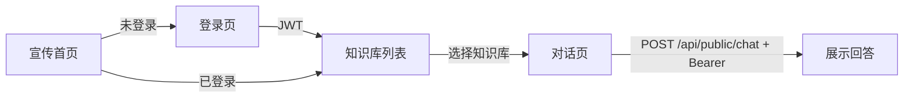

# uni-app 页面模块说明

## 路由

| 页面 | 路由 | 登录 | 功能 |
|------|------|------|------|
| 宣传首页 | `/pages/home/home` | 否 | 产品介绍、动效、引导登录/进入 |
| 登录 | `/pages/login/login` | — | 后台账号 JWT 登录 |
| 知识库 | `/pages/kb/list` | 是 | 公开知识库列表 |
| 对话 | `/pages/chat/chat?kbId=&kbName=` | 是 | AI 问答 + 引用 |

## 组件

| 组件 | 说明 |
|------|------|
| `components/ChatBubble.vue` | 用户/助手消息气泡 |
| `components/ReferenceList.vue` | 回答引用来源列表 |

## 交互流程

## 认证

- Token 存 `uni.storage`：`access_token`
- 用户信息：`user_profile`
- 知识库/对话接口需 Header：`Authorization: Bearer <token>`
- 401 自动跳转登录页

## 会话续聊

- 每个知识库独立 `session_id`，存于 `session_{kbId}`
- 进入对话页时 `GET /api/public/chat/sessions/{id}/messages` 恢复历史

## 平台差异

| 能力 | H5 | 微信小程序 |
|------|-----|-----------|
| 问答 | 非流式 | 非流式 |
| API 基址 | 生产 `un.easytransfer.top` | 同左 |
| 请求头 | `X-Client-Type: h5` | `X-Client-Type: mp-weixin` |
