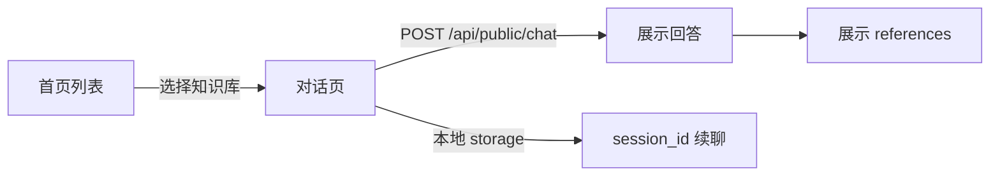

# uni-app 页面模块说明

## 路由

| 页面 | 路由 | 功能 |
|------|------|------|
| 首页 | `/pages/index/index` | 拉取公开知识库列表，点击进入对话 |
| 对话 | `/pages/chat/chat?kbId=&kbName=` | 与指定知识库 AI 问答 |

## 组件

| 组件 | 说明 |
|------|------|
| `components/ChatBubble.vue` | 用户/助手消息气泡 |
| `components/ReferenceList.vue` | 回答引用来源列表 |

## 交互流程

## 会话续聊

- 每个知识库独立 `session_id`，存于 `uni.storage`：`session_{kbId}`
- 进入对话页时尝试 `GET /api/public/chat/sessions/{id}/messages` 恢复历史

## 平台差异

| 能力 | H5 | 微信小程序 |
|------|-----|-----------|
| 问答 | 非流式 `/api/public/chat` | 非流式（不支持 SSE） |
| 请求头 | `X-Client-Type: h5` | `X-Client-Type: mp-weixin` |
| 合法域名 | 同域或 CORS | 需配置 request 合法域名 |
